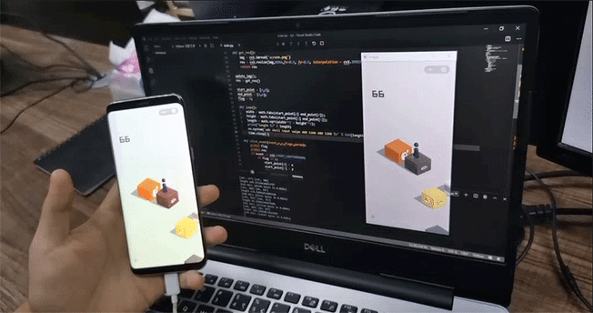

# 跳一跳 微信小游戏辅助工具

> 仅支持安卓

非常简单跳一跳辅助代码,

## 效果演示

## 环境准备

`python3.x`

`android adb 工具`

需要安装 opencv-python
```shell
pip install opencv-python
```

根据手机像素不同,`main.py`文件中修改这两个参数来达到准确的位置, 测试用的手机为三星S8.

```python
# 距离转时间系数
DTC = 0.208 
# 手机屏幕缩放比例
SCA = 0.3
```
## 启动运行

* 打开跳一跳小游戏
* 运行`python main.py`

鼠标点选起点和终点,等待即可.

